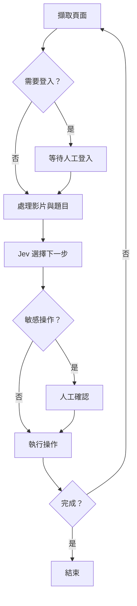

  

## 結論

用 **Playwright 負責操作瀏覽器、Jev 負責選擇下一步、人類處理登入與例外狀況**，可以做出一套適合互動課程、影片與問卷的半自動瀏覽器助手。

## 適合用在哪裡

- 重複性高的互動教學、影片課程與問卷。
- 網頁流程不固定，無法只靠 CSS Selector 寫死。
- 希望自動操作，但卡住時仍能讓人直接接手。
- 不適合驗證碼、正式考試或平台禁止自動操作的情境。
## 流程步驟

### 1. 用 Jev 決定下一個操作

Jev 不產生文字，而是處理 `noul`、`choice`、`score` 這類決策。瀏覽器每一步通常只是判斷「完成了嗎」、「需要登入嗎」、「下一個點哪個」，因此比一般 LLM 更適合這種場景。

一次請求可以共用同一份 `state`，同時詢問多個問題：

```python
import os
import requests

def ask(state, questions):
    response = requests.post(
        "<https://openrouter.ai/api/alpha/decisions>",
        headers={
            "Authorization": f"Bearer {os.environ['OPENROUTER_API_KEY']}"
        },
        json={
            "model": "typesafe/jev-1.13",
            "state": state,
            "questions": questions,
        },
        timeout=30,
    )
    response.raise_for_status()
    return response.json()["answers"]
```

候選元素太多時，不要一次全部丟給 Jev。可以每 40 個元素分組，各組留下前幾名，再進行下一輪選擇。

### 2. 用 Playwright 擷取與操作頁面

Playwright 負責掃描頁面、iframe、影片與可點擊元素，再整理成 Jev 能判斷的文字：

```plain text
<button> 下一步 @ bottom-center
<button> 設定 @ top-right [highlighted]
<div> 閱讀更多 @ middle-center
```

元素來源不能只掃 `button`，實務上還需要包含：

- `a`、`[role=button]`
- `cursor: pointer`
- class 含 `btn`、`next`、`arrow`
- `elementFromPoint()` 掃描出的可互動元素
- 多層 iframe 內的元素
像 Articulate Storyline 這類工具，畫面上的按鈕可能只是圖片，真正帶名稱的是下面的透明元素。這時不能直接呼叫元素的 `click()`，而是取得座標後用滑鼠點擊。

### 3. 建立固定決策迴圈

每一步只做幾件事：

1. 擷取目前頁面與候選元素。
1. 判斷是否需要登入。
1. 處理正在播放的影片。
1. 處理單選、複選或設定檔中的文字答案。
1. 問 Jev 是否完成，以及下一步點哪個。
1. 點擊後等待頁面穩定。
1. 偵測重複操作，避免無限迴圈。


### 4. 保留人工接手機制

全自動很容易卡在未知介面，因此設計重點不是「完全不需要人」，而是讓人只處理 Jev 不知道的部分。

實作上保留：

- **等待選項**：沒有合理操作時先等待，不亂點。
- **低信心詢問**：信心低於門檻時讓人選。
- **安全確認**：送出、退出、刪除等操作先確認。
- **人工提示**：把使用者提示加入下一輪 `state`。
- **記住按鈕**：人工點過一次後，記住文字供後續優先選擇。
例如「資訊要點 1、2、3」可以忽略數字與標點後統一視為「資訊要點」，避免每個同類按鈕都重新詢問。

## 補充

- Playwright Sync API 的瀏覽器操作需集中在同一執行緒，其他執行緒只負責排工作或切換狀態。
- 多層 iframe 座標應依「巢狀層級」換算，不要用 iframe 面積判斷，尺寸相同時容易選錯。
- `.env`、瀏覽器登入資料與 `runs/` 診斷紀錄可能包含 API Key、Cookie 或頁面內容，記得放進 `.gitignore`。
## 指令 / 範例整理

- Click to expand
```bash
# 安裝相依套件
uv sync

# 建立環境設定
copy .env.example .env

# 啟動 GUI
uv run jev-browse gui
```

`.env`：

```plain text
OPENROUTER_API_KEY=your_key
```

`profile.toml`：

```toml
persona = "公司內部員工，對課程整體滿意；評分題傾向給 4 分。"

[text_answers]
"部門" = "資訊部"
"建議" = "無"
```

常用操作：

| 指令 | 用途 |
| --- | --- |
| `開始` / `暫停` / `繼續` / `停止` | 控制執行 |
| `略過影片` | 本次不等待影片 |
| `記住 文字` | 優先選擇指定按鈕 |
| `不要點 文字` | 排除指定按鈕 |
| `忘記 文字` | 移除記錄 |
| `診斷` | 保存頁面、iframe 與元素資料 |

## 收尾

這套做法的核心不是讓 AI 直接控制整個瀏覽器，而是把問題縮小成一連串「下一步選哪個」的決策。

Playwright 管操作、Jev 管判斷、人類管例外，通常比追求全自動更穩。

## 參考來源

[https://openrouter.ai/docs/guides/community/jev-tutorial](https://openrouter.ai/docs/guides/community/jev-tutorial)

[https://docs.astral.sh/uv/](https://docs.astral.sh/uv/)

