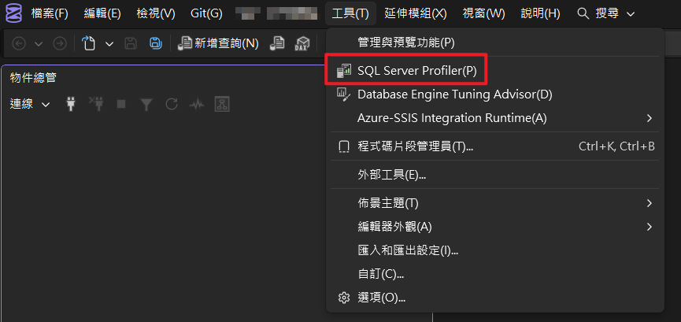
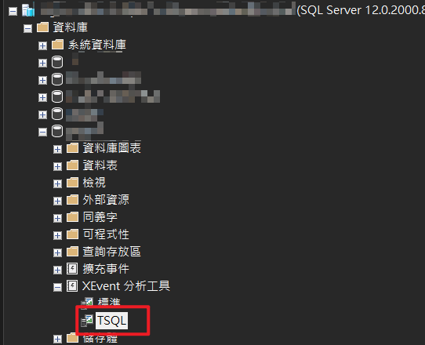

## Conclusion

SQL Server can directly use SQL Server Profiler for real-time SQL monitoring. However, Azure SQL Database does not support Profiler and requires using Extended Events (XEvent) with TSQL to query event data instead.

## Where It's Useful

- Querying 'who is executing SQL'
- Analyzing real-time SQL for APIs / systems
- Troubleshooting slow queries and high CPU SQL
- When Profiler cannot be used with Azure SQL
- Performance analysis for DBAs / Backend Engineers
## Steps

### 1. General SQL Server: Directly Using SQL Server Profiler

- The most common traditional approach for SQL Server
- Can see in real-time:
  - SQL currently executing
  - Duration
  - CPU
  - Login User
  - Application Name
- Suitable for:
  - On-Prem SQL Server
  - VM SQL Server
  - Short-term real-time debugging
Operation location:

- SSMS → Tools → SQL Server Profiler


Common events:

- RPC:Completed
- SQL:BatchCompleted
- SP:StmtCompleted
Common Filters:

```plain text
ApplicationName
LoginName
DatabaseName
Duration
TextData
```

In practice, filters are usually essential; otherwise, large systems will spew SQL like a waterfall, leading to immediate eye strain (´-ω-`)

### 2. Azure SQL Database: Using Extended Events (XEvent) Instead

- Azure SQL Database does not support SQL Server Profiler
- The official recommendation is also gradually shifting to XEvent
- Better performance than Profiler
- Customizable tracing conditions
Creating an XEvent Session:

```plain text
CREATE EVENTSESSION MonitorSQL
ON DATABASE
ADD EVENT sqlserver.sql_batch_completed(
ACTION (
        sqlserver.client_app_name,
        sqlserver.client_hostname,
        sqlserver.username
    )
)
ADD TARGET package0.ring_buffer;
GO
```

Starting the Session:

```plain text
ALTER EVENTSESSION MonitorSQL
ON DATABASE
STATE=START;
GO
```

Operation location:

- SSMS → XEvent Analysis Tools → TSQL


Here we use:

- `sql_batch_completed`
  - Monitor SQL execution completion
- `ring_buffer`
  - Temporary in-memory events
  - No additional file permissions required
Many Azure SQL environments lack file system permissions, so `ring_buffer` is usually prioritized.

### 3. Using TSQL to Query Real-time SQL Content

Once created, you can directly query XEvent content:

```plain text
SELECT
    event_data.value('(event/@name)[1]','varchar(50)')AS EventName,
    event_data.value('(event/data[@name="duration"]/value)[1]','bigint')/1000AS DurationMs,
    event_data.value('(event/action[@name="client_app_name"]/value)[1]','nvarchar(256)')AS AppName,
    event_data.value('(event/action[@name="username"]/value)[1]','nvarchar(256)')AS UserName,
    event_data.value('(event/data[@name="batch_text"]/value)[1]','nvarchar(max)')AS SQLText
FROM (
SELECTCAST(xet.target_dataAS XML)AS target_data
FROM sys.dm_xe_database_sessions s
JOIN sys.dm_xe_database_session_targets xet
ON s.address= xet.event_session_address
WHERE s.name='MonitorSQL'
) t
CROSS APPLY target_data.nodes('//RingBufferTarget/event')AS x(event_data);
```

You can see:

- SQL content
- Execution time
- User
- Calling App
- Host Name
Extremely useful for API systems, especially for checking:

- Which API is overwhelming the DB
- What SQL EF Core generates
- Which scheduled job is running excessively
## Additional Notes

- Profiler has poorer performance when left open for extended periods; long-term use on production servers is not recommended.
- For Azure SQL, it's recommended to use Query Store in conjunction for analyzing slow SQL.
- If XEvent is not stopped, event data will continue to accumulate.
## Commands / Examples Summary

<details>
<summary>Click to expand</summary>

```plain text
-- 建立 XEvent
CREATE EVENTSESSION MonitorSQL
ON DATABASE
ADD EVENT sqlserver.sql_batch_completed(
ACTION (
        sqlserver.client_app_name,
        sqlserver.client_hostname,
        sqlserver.username
    )
)
ADD TARGET package0.ring_buffer;
GO

-- 啟動 XEvent
ALTER EVENTSESSION MonitorSQL
ON DATABASE
STATE=START;
GO

-- 查詢 XEvent
SELECT
    event_data.value('(event/@name)[1]','varchar(50)')AS EventName,
    event_data.value('(event/data[@name="duration"]/value)[1]','bigint')/1000AS DurationMs,
    event_data.value('(event/action[@name="client_app_name"]/value)[1]','nvarchar(256)')AS AppName,
    event_data.value('(event/action[@name="username"]/value)[1]','nvarchar(256)')AS UserName,
    event_data.value('(event/data[@name="batch_text"]/value)[1]','nvarchar(max)')AS SQLText
FROM (
SELECTCAST(xet.target_dataAS XML)AS target_data
FROM sys.dm_xe_database_sessions s
JOIN sys.dm_xe_database_session_targets xet
ON s.address= xet.event_session_address
WHERE s.name='MonitorSQL'
) t
CROSS APPLY target_data.nodes('//RingBufferTarget/event')AS x(event_data);

-- 停止 XEvent
ALTER EVENTSESSION MonitorSQL
ON DATABASE
STATE= STOP;
GO

-- 刪除 XEvent
DROP EVENTSESSION MonitorSQLON DATABASE;
GO
```

</details>

## Conclusion

Previously, catching SQL relied on Profiler. Now, in the era of Azure SQL, XEvent has almost become a standard.

With a well-written XEvent TSQL script, many performance issues no longer require guesswork or intuition.
