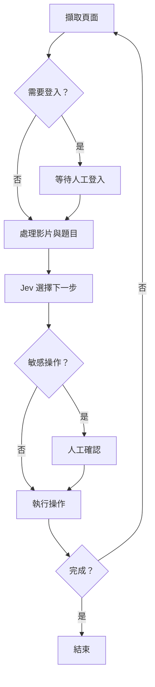

  
## Conclusion

By using **Playwright for browser operations, Jev for deciding the next step, and humans for handling logins and exceptions**, you can create a semi-automated browser assistant suitable for interactive courses, videos, and questionnaires.

## Where it's suitable

- Highly repetitive interactive tutorials, video courses, and questionnaires.
- Web processes that are not fixed and cannot be hardcoded with CSS Selectors alone.
- Desiring automated operations, but still allowing direct human intervention when stuck.
- Not suitable for CAPTCHAs, formal exams, or scenarios where platforms prohibit automated operations.
## Flow Steps

### 1. Use Jev to decide the next operation

Jev does not generate text; instead, it handles decisions like `noul`, `choice`, and `score`. Each step in a browser operation typically involves judging "Is it done?", "Does it need login?", or "Which one to click next?", making it more suitable for this scenario than general LLMs.

A single request can share the same `state` and ask multiple questions simultaneously:

```python
import os
import requests

def ask(state, questions):
    response = requests.post(
        "<https://openrouter.ai/api/alpha/decisions>",
        headers={
            "Authorization": f"Bearer {os.environ['OPENROUTER_API_KEY']}"
        },
        json={
            "model": "typesafe/jev-1.13",
            "state": state,
            "questions": questions,
        },
        timeout=30,
    )
    response.raise_for_status()
    return response.json()["answers"]
```

When there are too many candidate elements, do not throw all of them to Jev at once. You can group them into batches of 40 elements, keep the top few from each group, and then proceed to the next round of selection.

### 2. Use Playwright to capture and operate pages

Playwright is responsible for scanning pages, iframes, videos, and clickable elements, then organizing them into text that Jev can interpret:

```plain text
<button> 下一步 @ bottom-center
<button> 設定 @ top-right [highlighted]
<div> 閱讀更多 @ middle-center
```

The source of elements should not only scan `button`; in practice, it also needs to include:

- `a`, `[role=button]`
- `cursor: pointer`
- classes containing `btn`, `next`, `arrow`
- interactive elements scanned by `elementFromPoint()`
- elements within multiple layers of iframes
Like tools such as Articulate Storyline, buttons on the screen might just be images, while the actual named elements are transparent elements underneath. In such cases, you cannot directly call the element's `click()`; instead, you need to get the coordinates and click with the mouse.

### 3. Establish a fixed decision loop

Each step only does a few things:

1. Capture the current page and candidate elements.
2. Determine if login is required.
3. Process currently playing videos.
4. Handle single-choice, multiple-choice, or text answers from the configuration file.
5. Ask Jev if it's complete and which element to click next.
6. Wait for the page to stabilize after clicking.
7. Detect repetitive operations to avoid infinite loops.


### 4. Retain human handoff mechanism

Full automation can easily get stuck on unknown interfaces, so the design focus is not "no human needed at all," but rather letting humans handle only the parts Jev doesn't know.

In practice, we retain:

- **Waiting for options**: Wait when there are no reasonable operations, instead of clicking randomly.
- **Low-confidence query**: Let humans choose when confidence is below the threshold.
- **Safety confirmation**: Confirm operations like submit, exit, or delete.
- **Human prompt**: Add user prompts to the next round of `state`.
- **Remember buttons**: After a human clicks once, remember the text for subsequent prioritized selection.
For example, "Information Point 1, 2, 3" can be treated uniformly as "Information Point" after ignoring numbers and punctuation, avoiding re-querying for every similar button.

## Supplement

- Playwright Sync API browser operations must be concentrated in a single thread; other threads are only responsible for scheduling tasks or switching states.
- Coordinates for multi-layered iframes should be calculated based on "nesting level," not iframe area, as it's easy to select incorrectly when sizes are identical.
- `.env`, browser login data, and `runs/` diagnostic logs may contain API Keys, Cookies, or page content; remember to add them to `.gitignore`.
## Commands / Example Summary

- Click to expand
```bash
# 安裝相依套件
uv sync

# 建立環境設定
copy .env.example .env

# 啟動 GUI
uv run jev-browse gui
```

`.env`:

```plain text
OPENROUTER_API_KEY=your_key
```

`profile.toml`:

```toml
persona = "公司內部員工，對課程整體滿意；評分題傾向給 4 分。"

[text_answers]
"部門" = "資訊部"
"建議" = "無"
```

Common operations:

| Command | Purpose |
| --- | --- |
| `Start` / `Pause` / `Resume` / `Stop` | Control execution |
| `Skip video` | Do not wait for video this time |
| `Remember Text` | Prioritize selecting the specified button |
| `Don't click Text` | Exclude the specified button |
| `Forget Text` | Remove record |
| `Diagnose` | Save page, iframe, and element data |

## Wrap-up

The core of this approach is not to let AI directly control the entire browser, but to narrow down the problem into a series of "which one to choose next" decisions.

Playwright handles operations, Jev handles decisions, and humans handle exceptions, which is generally more stable than pursuing full automation.

## References

[https://openrouter.ai/docs/guides/community/jev-tutorial](https://openrouter.ai/docs/guides/community/jev-tutorial)

[https://docs.astral.sh/uv/](https://docs.astral.sh/uv/)
